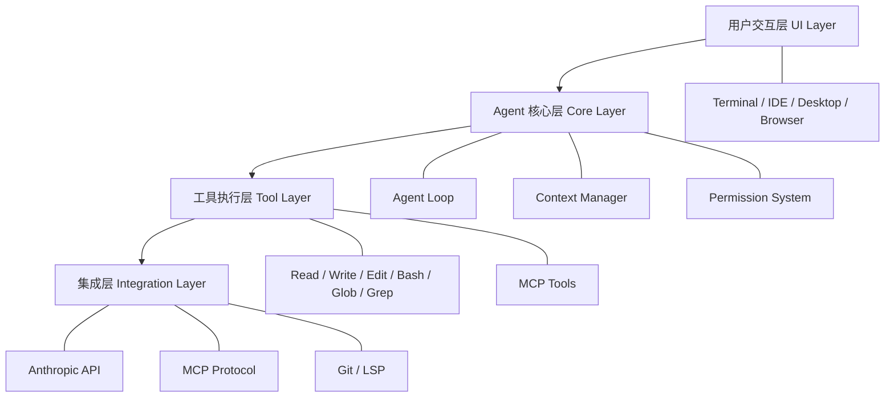
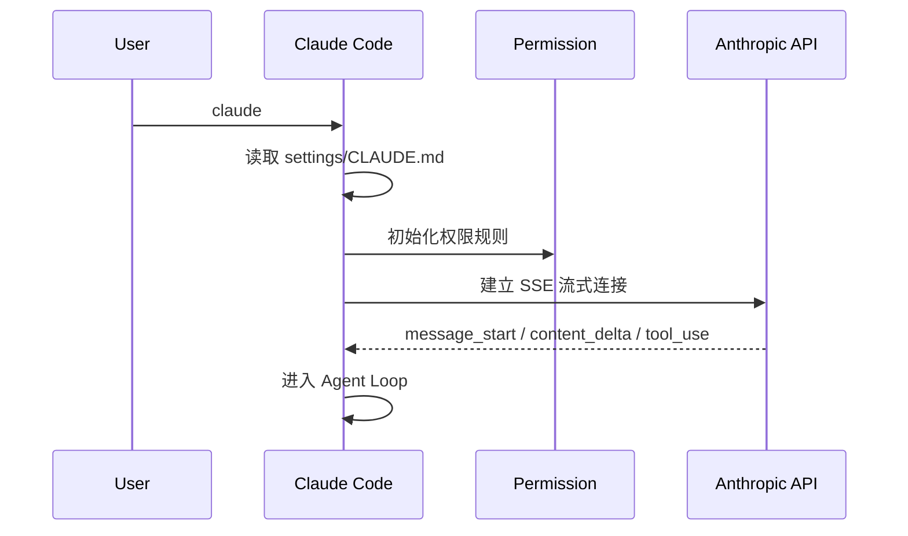
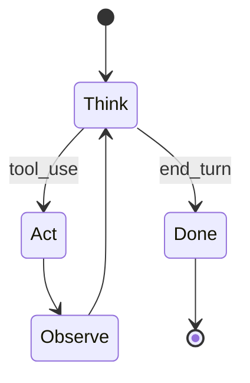
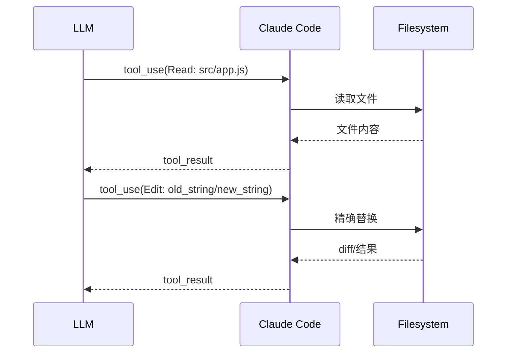
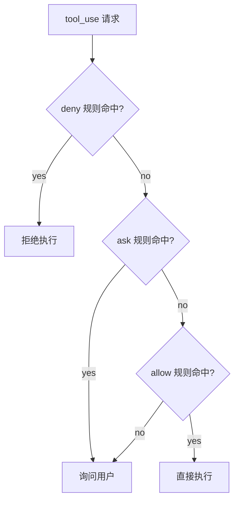
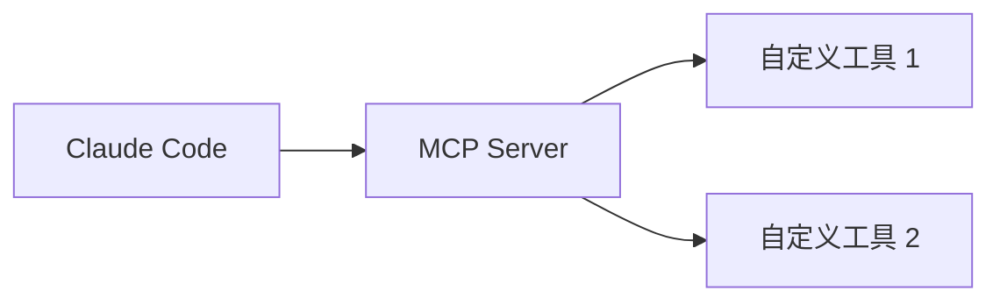
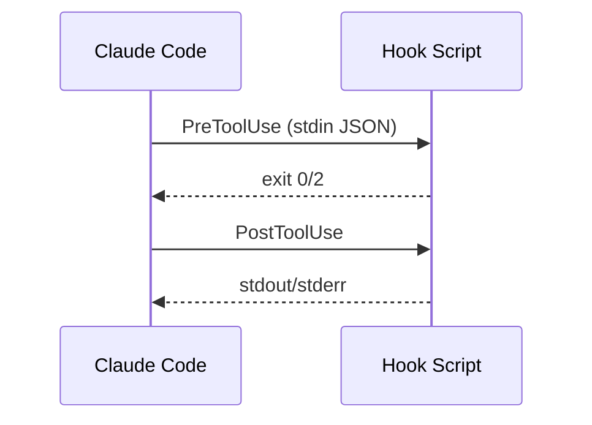

# 从 CLI 到 Agent Runtime：Claude Code 的架构解剖（面向工程实践）

Claude Code 在表面上只是一个命令行工具，但它真正的价值，是把“多步智能体”落地成工程化运行时。本文以架构为主线，拆解它的层次、启动链路、核心循环与安全边界，帮助你建立一个清晰的系统图景。

---

## 一、总览：四层架构与角色分工

Claude Code 可以理解为一个“Agent Runtime”，核心架构可以简化为四层：



**理解这张图的关键点**：
- UI 只是入口，核心逻辑统一在 Agent Core。
- 工具执行是“真实世界”的桥接层，带来可验证的行动。
- Integration 让它能接入外部能力与生态。

---

## 二、启动链路：从命令到智能体循环

Claude Code 的启动不是“执行脚本”，而是“启动一个 Agent 运行时”。



这里的关键不是“执行一次命令”，而是**进入一个可持续的状态机**。

---

## 三、核心循环：Think → Act → Observe

Agent Core 的本质是一个循环状态机：模型思考、调用工具、观察结果，再进入下一轮。



这个循环由 API 的 `stop_reason` 驱动：
- `tool_use`：继续执行工具
- `end_turn`：任务完成退出
- `max_tokens`：触发上下文压缩

**价值**：
- 让任务从“一次性回答”变成“多步完成”。
- 将“思考”和“行动”分离，形成可控的工程流。

---

## 四、工具闭环：模型如何“真正动手”

Claude Code 的核心能力来自 Tool Use：模型不是直接改文件，而是输出工具调用，再由系统执行。



这种“闭环”让系统具备两种关键能力：
- **可验证性**：每一步操作都有执行结果。
- **可迭代性**：失败可以重试或换策略。

---

## 五、安全与控制：权限门禁 + 沙箱

Agent Runtime 的最大风险是“行动失控”。Claude Code 用两层机制控制风险：

### 1) 权限规则（allow / ask / deny）



### 2) 沙箱机制（文件与网络隔离）

```
文件系统隔离：限制可读写目录
网络隔离：只允许白名单域名
```

**核心思想**：权限系统决定“能不能做”，沙箱决定“能做多远”。

---

## 六、扩展与规模化：MCP 与 Hooks

当 Claude Code 不只是个人工具，而要进入团队/企业环境时，扩展能力至关重要。

### MCP：扩展工具能力



### Hooks：将 Agent 接入自动化流程



**理解 Hook 的价值**：它让 Claude Code 不只是“智能体”，而是“可编排的工作流节点”。

---

## 七、总结：为什么它是 Agent Runtime 而不是 CLI

传统 CLI 的逻辑是“输入 → 输出”；Claude Code 的逻辑是“输入 → 循环 → 可验证行动”。

**核心价值抽象为三句话**：
1. 它是一个可持续运行的 Agent Loop，而非一次性命令。
2. 它通过工具闭环把模型输出转化为可验证行动。
3. 它通过权限与沙箱让“智能体能力”在工程上可控。

如果你把 Claude Code 当作一个真正的运行时系统，而不是一个命令行工具，你会更容易理解它的设计，也更容易把它融入团队的开发流程。

---

> 下一步建议：
> - 如果关注“核心运行机制”，继续深入 Agent Loop。  
> - 如果关注“团队落地”，重点研究权限、Hooks 和 Subagent。
